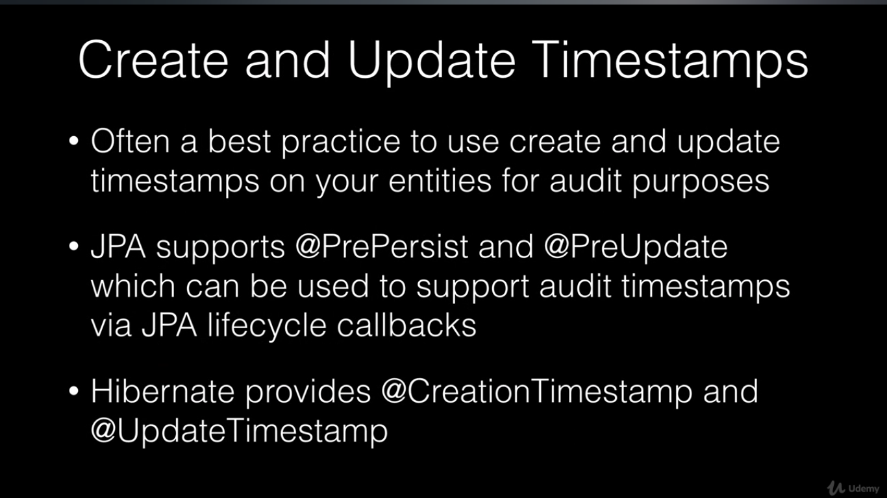

## JPA data modeling with Hibernate
***
### Create JPA Entities
In order to create JPA entities we define our Pojo which represents a table in database, then
We annotate the class with `@Entity` coming from javax package. Hibernate specification deprecated
the annotation coming from its own packages. 
We also need to define a Primary key which we usually take a Long or UUID field and annotate it
with `@Id` which is followed by `@GeneratedValue` annotation which specifies what strategy we keep 
for generating our Primary keys.
* `GenerationType.IDENTITY`: uses database AUTO_INCREMENT if it is supported.
* `GenerationType.AUTO` databases like oracle don't support AUTO_INCREMENT and use a sequence to increment
value of field, we use this option. By using this, hibernate creates a sequence for us but, we can
also specify a user defined sequence.

### Entity Field DataTypes
We can also define datatype for the field for example for large String values
we can use `@Lob` which  is clob in database.

### Entity Relationships

> PRO TIP: On Bidirectional relationships we can use Helper methods to set the objects on both sides.

### JPA Enumerations
We can also declare Enum dependency to our pojo and for the type in database we annotate it with
`@Enumerated` and we pass value `EnumType.ORDINAL` or `EnumType.STRING`
Ordinal will persist numeric values in database. Using String we can store String values to database.
