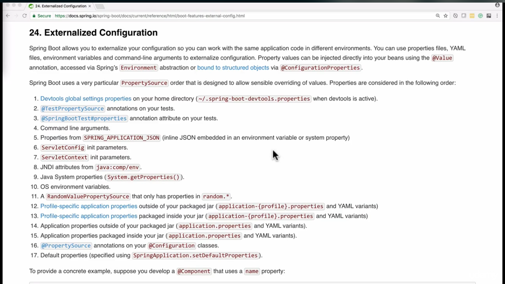

## External Properties Configurations

***

### Why?

Most of the time we want to read configuration from properties file isolated from Classes.
<br>
We define our properties files inside resources' folder. Then we can add a PropertySourcesPlaceHolderConfigurer bean
inside configuration class, then provide values to properties we want, using spEL.
</br>*Properties File*

### Basic Example
```properties
ds.mysql.username=root
ds.mysql.password=root
ds.mysql.url=root
```

*Configuration Class*

```java

import org.springframework.beans.factory.annotation.Value;
import org.springframework.context.annotation.Bean;
import org.springframework.context.annotation.PropertySource;
import org.springframework.context.support.PropertySourcesPlaceholderConfigurer;

@org.springframework.context.annotation.Configuration
@PropertySource("classpath:/pathToProperties")
public class FooConfiguration {
    @Value("${ds.mysql.username}")
    private String username;
    @Value("${ds.mysql.password}")
    private String password;
    @Value("${ds.mysql.url}")
    private String url;

    @Bean
    public PropertySourcesPlaceholderConfigurer propertySourcesPlaceholderConfigurer() {
        PropertySourcesPlaceholderConfigurer propertySourcesPlaceholderConfigurer = new PropertySourcesPlaceholderConfigurer();
        return propertySourcesPlaceholderConfigurer;
    }
}
```
> We can Create a bean of the object that wraps these properties and use it.

### Spring environment variable
We can define environment variables in OS or just edit the run/debug configurations.
and set variables. 
These variables override the properties variables. if we set another name,
and we want to override properties variable we can simply `@Autowire` `Environment` 
and use `getProperty()` to set the value inside variable.

### Multiple Property Files
We can use multiple properties files by<br>
`@PropertySources({
    @PropertySource(),
    @PropertySource()
});`

> We can write these properties on application.properties file and still get them without
> creating `PropertySourcesPlaceholderConfigurer` bean or `@PropertySource`



### YAML
Using YAML properties is much newer and cooler!

### Spring Boot Profile Properties
We can declare properties files based on profiles.
"application.fa.properties"
In YAML we can split documents by "---"
This is much convenient.