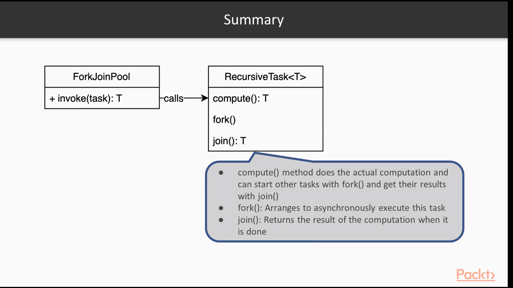

# Running Tasks in parallel using fork join pool

## commons-pool

We define workers and give them tasks to do using ForkJoinPool. In this scenario we define multiple callables that do
tasks in concurrently.
`ForkJoinPool.commonPool().invokeAll(Collection<Callable>);` We can see an apple picker example.

## Joining the result of Task using fork() join() and RecursiveTask

unlike above, we just define a single task for a worker, this worker can split the task into subtasks and delegate them
to others. This is done using `fork()` This splitting goes on till the workers can do the task themselves. But after
that we need to compose the result and `join()` does this. when task completes it waits for the task that created it
to complete so, it can combine the results.

