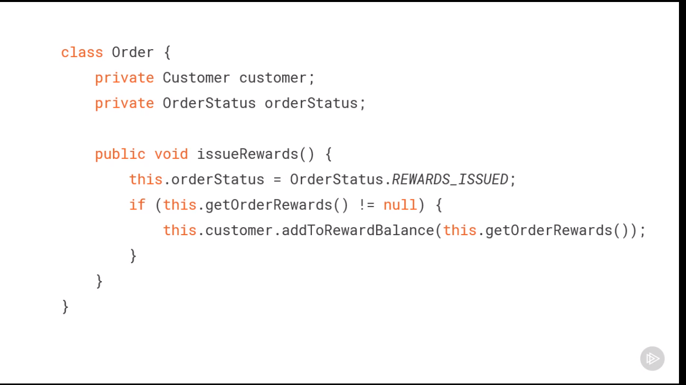
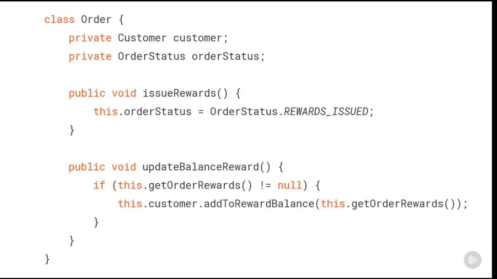
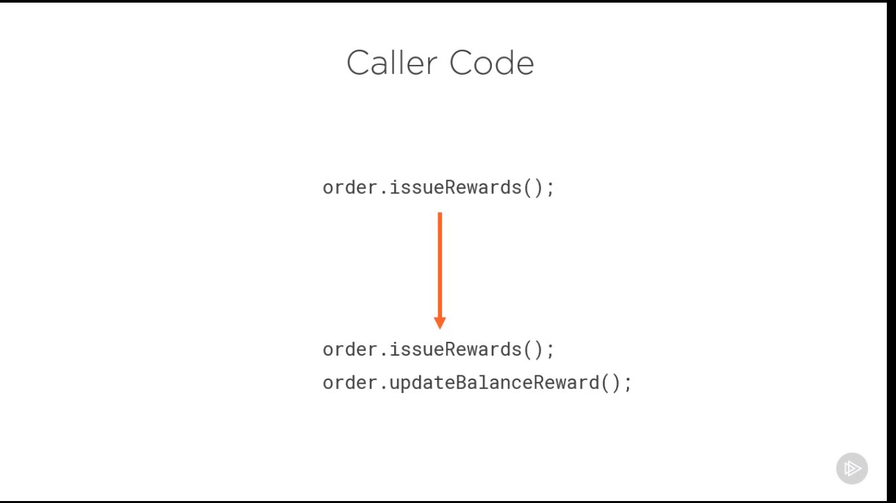
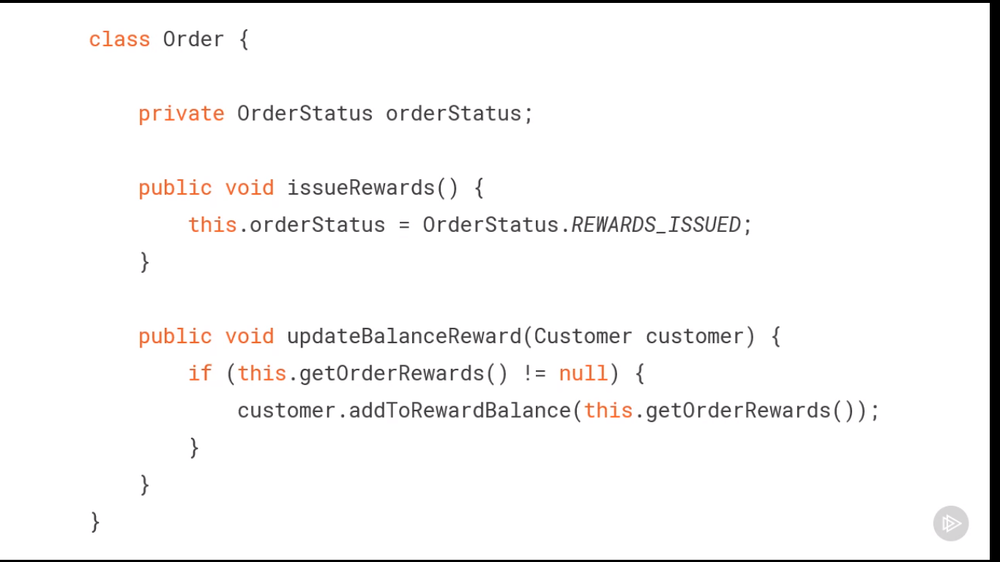
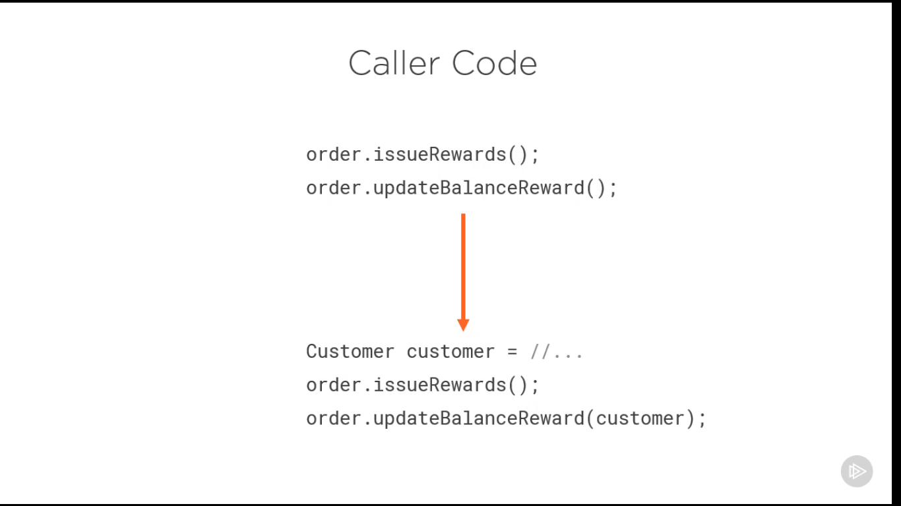

# Functional Programming

Unlike OOP in FP we focus on only functions and, we get rid of boilerplate.
Functions output is always the same no matter the condition or state. only input can change it.
Functions can have other functions as their input and outputs. Since Java 8 it's possible to code in functional style.

## Functional interfaces

Interfaces with only one abstract method are called functional interfaces. In imperative way of java programming we
write classes that implement interfaces explicitly, or we also could use anonymous classes. But with the help of lambdas
we can write anonymous classes in a more disciplined way with extra benefits.

> We can represent a functional interface using a lambda expression which may have weird syntax at first, but it's
> actually pretty straight forward.

Java has some predefined functional interfaces. we can classify them to 4 groups:

- Consumers: represents a function that takes input and does something but doesn't return anything.
- Suppliers: Opposite of consumers. function that has no input but returns a value.
- Functions: This maps a value to another value
- Predicates: This takes an input and checks if the object satisfies a criteria. (bool)

Consumers have a default method called andThen() which we can chain consumers together.
Suppliers have a method called get()
Functions accept two Generic types T,R for input and output of method apply(); we can also chain them like consumers.
We also have some special functions named UnaryOperator and BinaryOperator which extend this interface.
Predicate has a test() method. We can combine predicates using and(), or() and negate() methods.

## Lambda expressions

* We can omit type declaration when we are representing parameters in lambdas because compiler knows what type we are
  going to pass from interface itself.
* for single parameters we can also omit the parentheses.
* we concat parameter section to body of lambda using (->).
* if body has single line of code we can also omit the curly braces.
* We can also store these lambda functions in a variable.
* We can access instance & static variables and also this which represents the instance of the current class.

## Method reference:

if we have an already existed implementation of the functional interface we can only reference to it.
the syntax is pretty simple. we write the instance name followed by :: and name of the method.

## Functional Programming Design Concepts

In functional programming we will treat functions like pure functions in mathematics. means:

* They only do one thing
* don't depend on anything except their arguments.
* always give the same result

Java is not so much functional oriented but it's not the language that makes programming functional, it's the way we
code.

### Single Responsibility

This function issueRewards() has two jobs:

We can split it into these two methods but the caller should always make sure to call methods consecutively.

In Imperative way we maintain the state of Object inside the class but if we pass object as method parameter the caller
should maintain the state of object.

> void type is not applicable with void return type.

### No side effects

