# Cryptographic Failures

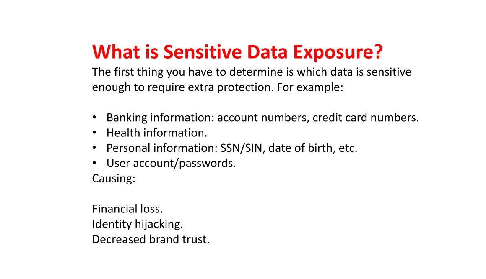
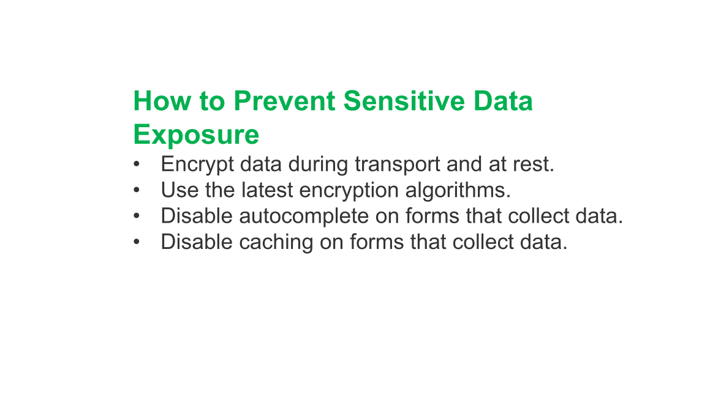
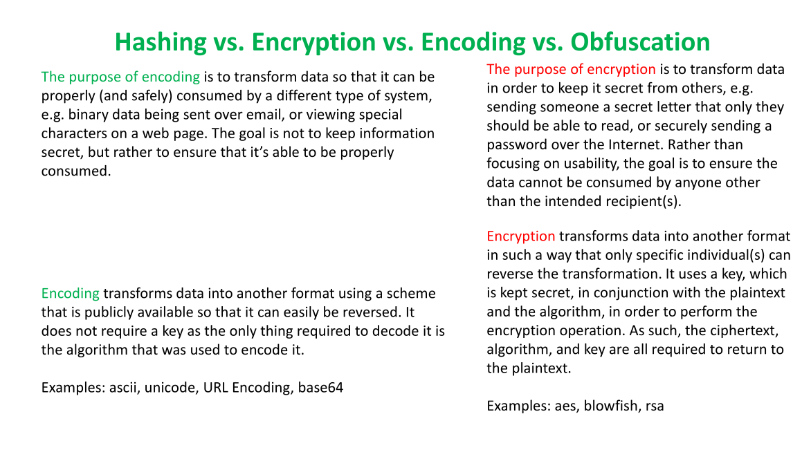
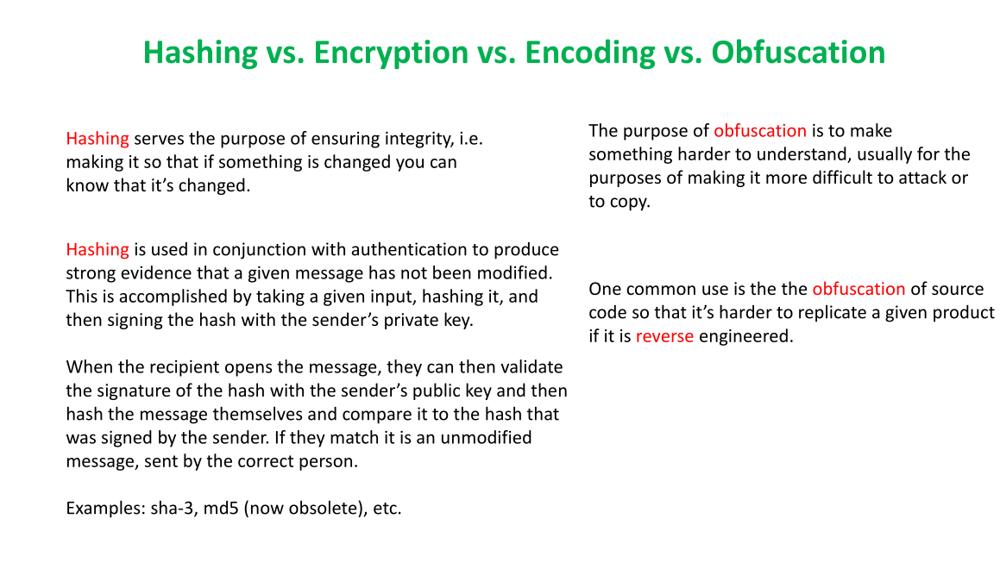

## Hashing algorithms

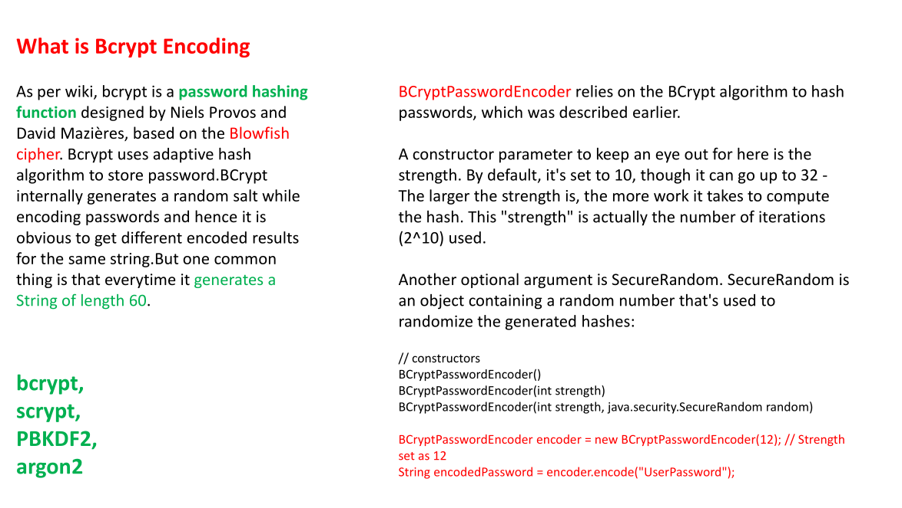
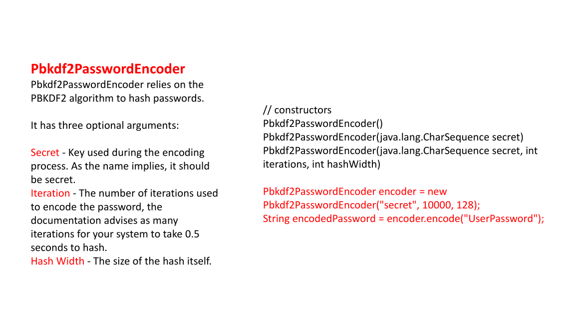
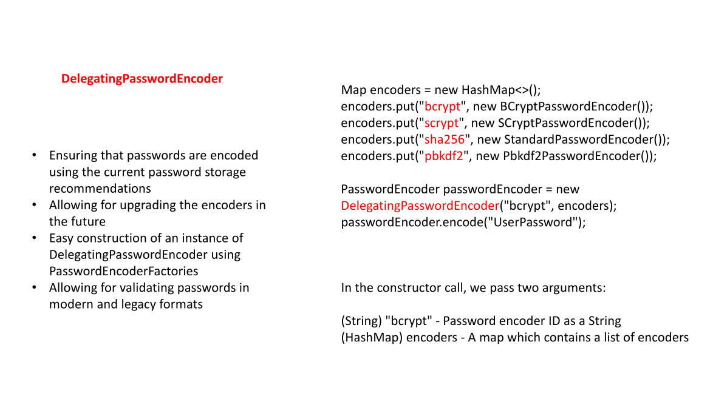
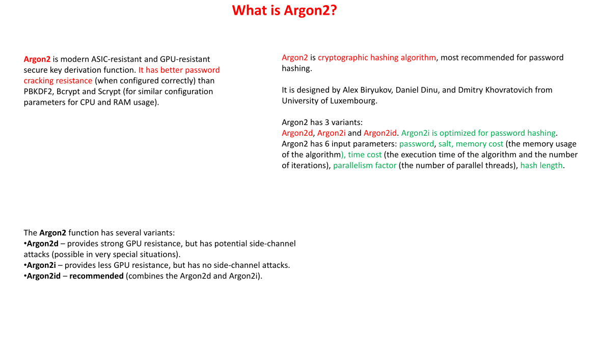
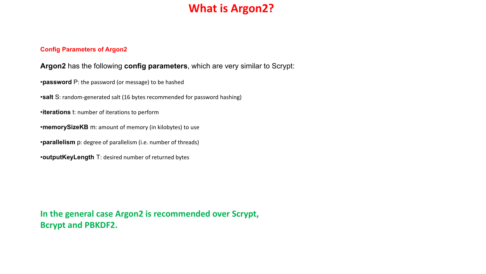

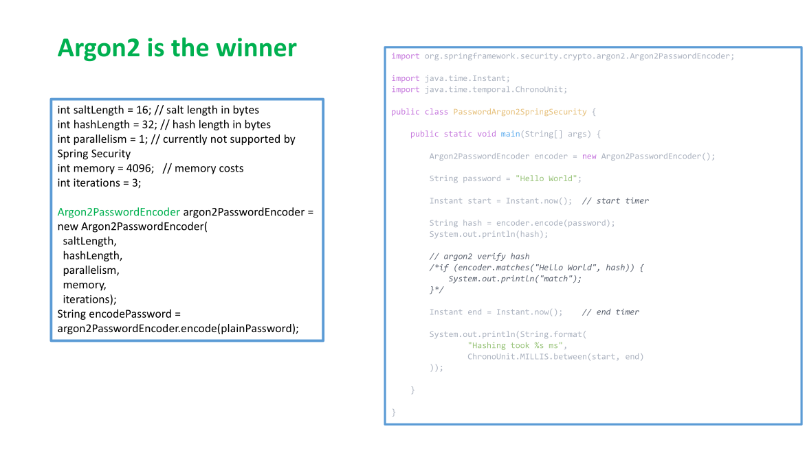

> In Rest API or Messaging sometimes we use HMAC which is the hash of the message so the receiver can check the
> integrity of the message or request.

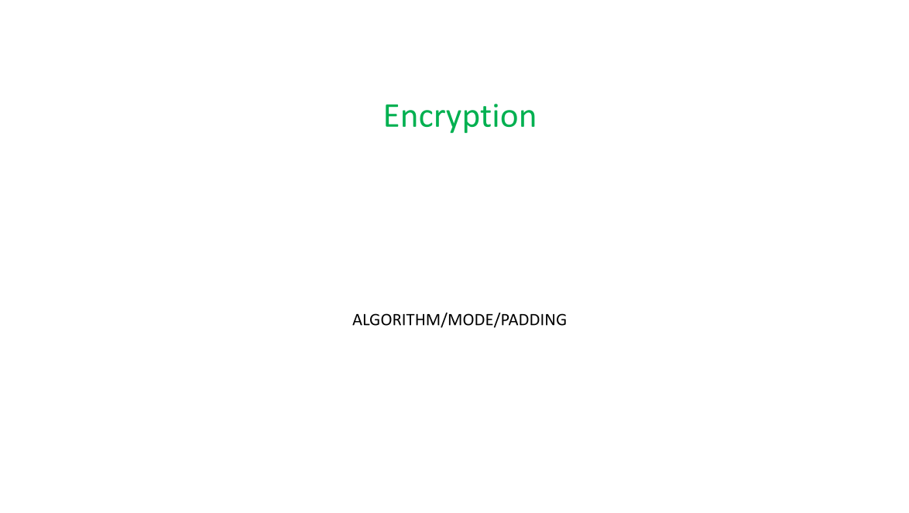

> block cipher modes define how the block is going to turn into cipher and secret data.

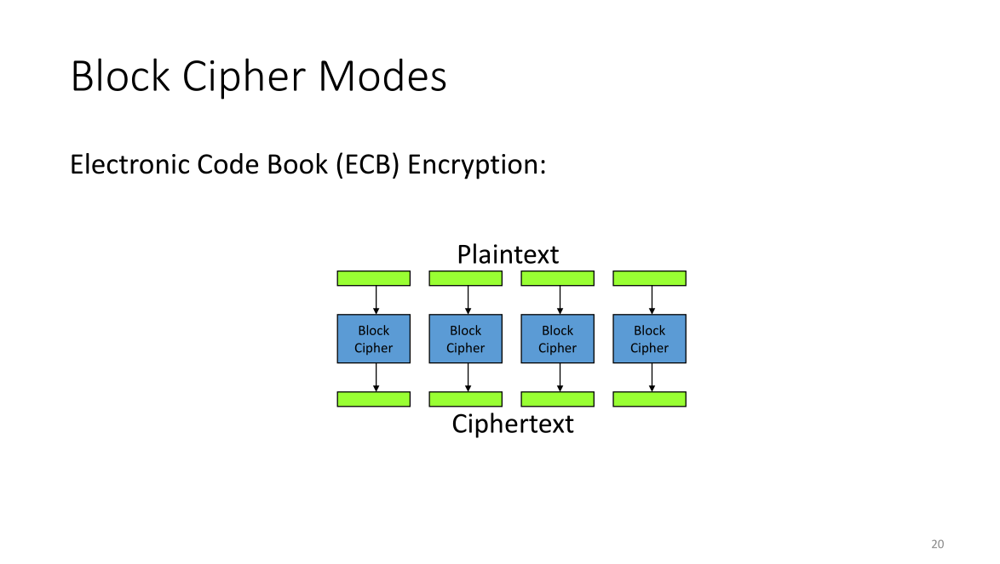

> we usually use CBC mode so, we start with an Initial value that results the first block in secret data and this will
> xor with plain file of next block.

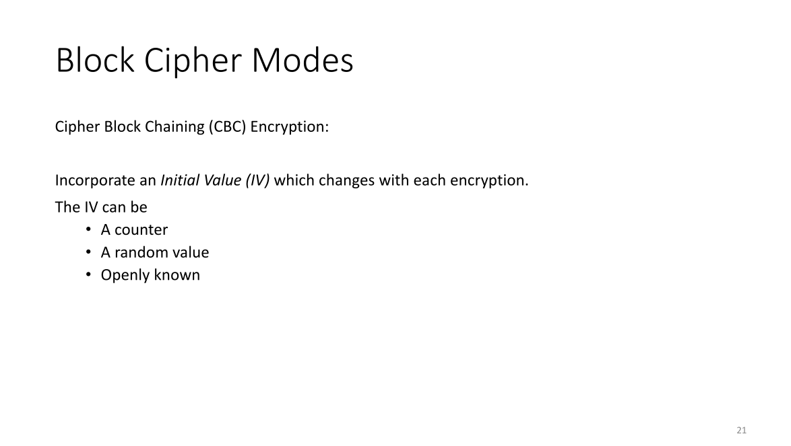
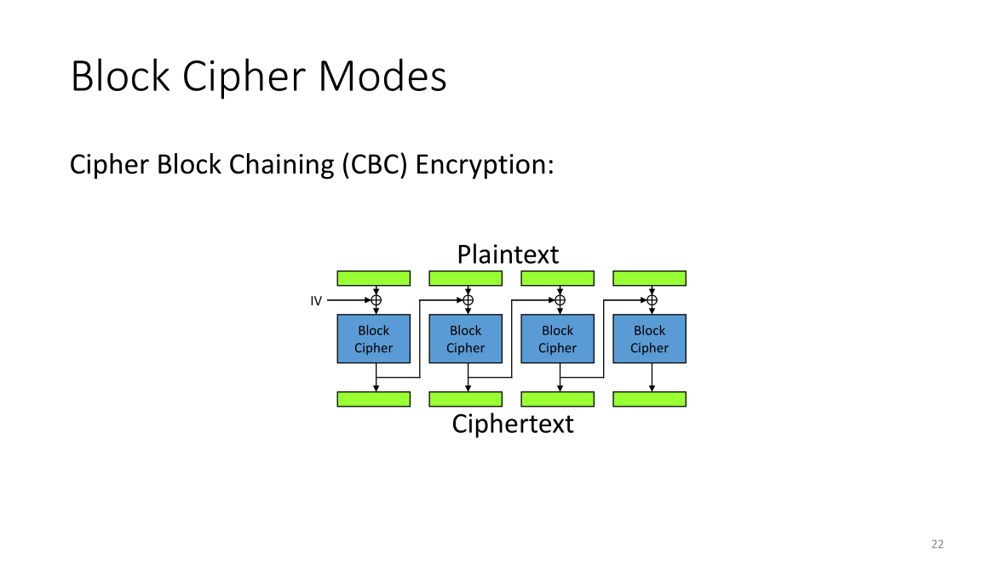

> In padding a block may have empty bytes, in padding we fill those empty bytes of blocks. in 8 bit if 5 are filled and
> 3 are empty. the empty will fill with 3. (totalByte - filledByte = emptyByteValue)

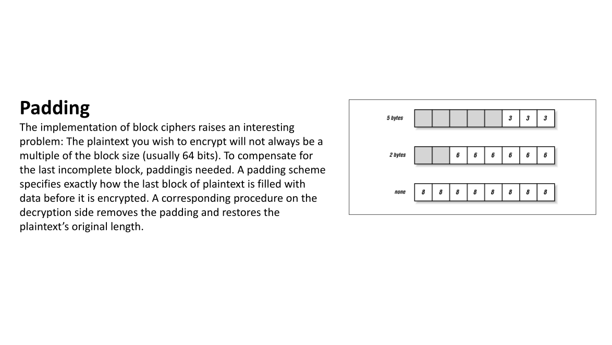

## RSA Algorithm

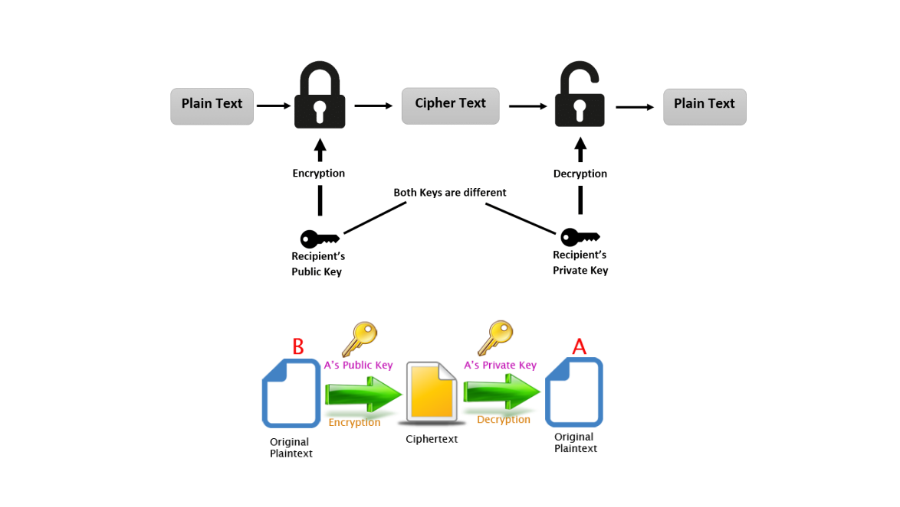
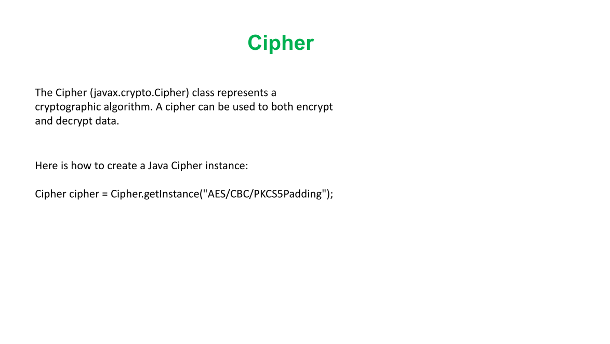

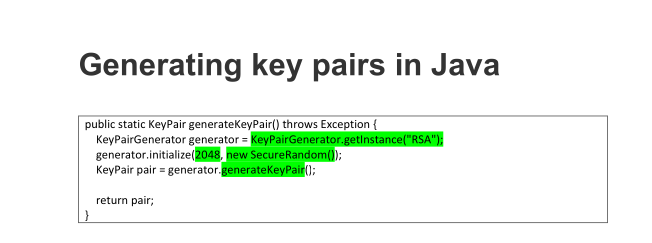

## PKCS standards

These standards define how the key should be generated for various purposes. We have classes in java that can generate
public or private key base on the standard we want.

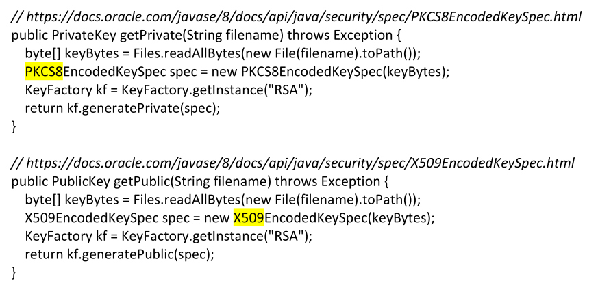

## SecureRandom vs Random

In order to generate IV or initialize keyGenerator we use SecureRandom class.

* `java.util.Random` class uses LOG algorithm which is not cryptographically strong(it is predictable)
  however,`java.security.SecureRandom` uses SHA1PRNG algorithm
* Random class has 48 bits but SecureRandom can have up to 128 bits.
* Random uses system clock as seed but, SecureRandom takes random data from OS. usually timing of I/O events mostly
  from/dev/random
* 2^48 attempts need to break random but, 2^128 for SecureRandom
* SecureRandom consumes more memory than Random.

Links:

* [Baeldung](https://www.baeldung.com/java-secure-random)
* [Techie delight](https://www.techiedelight.com/difference-java-util-random-java-security-securerandom/)
