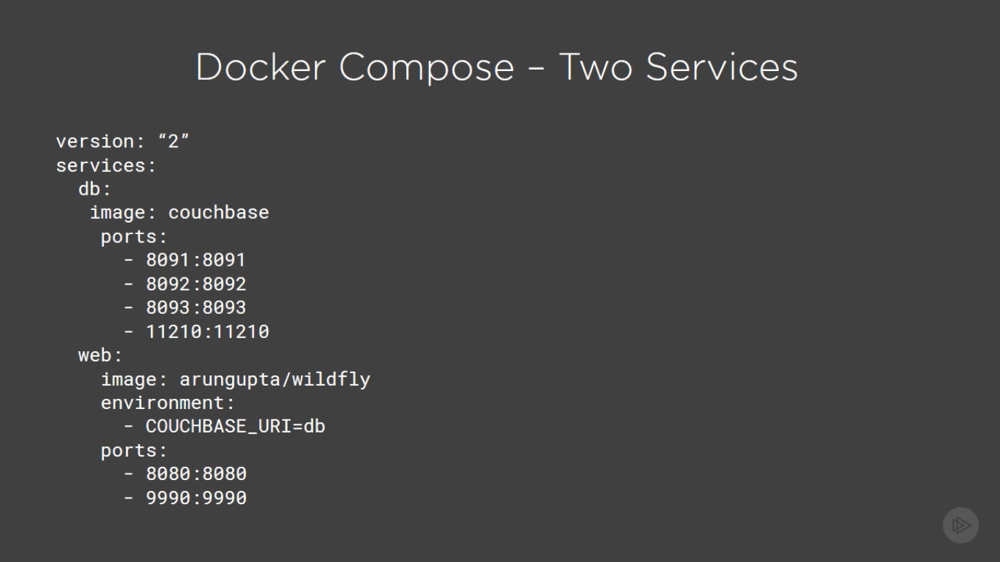

# Docker

---

## Basic Concepts

### History

In old days we had one server per app. so, we had to acquire Big Strong servers so 
most of the time the resources got wasted. Then VMare came with hypervisor solution 
in order to allocate resources to multiple virtual machines. 
But now we had the problem of that each vm was like a separated System which needed
to be configured. The OS and all apps.

This is where containers joined the game. We still had the big strong hardware but
instead of hypervisor and multiple OSs we had One OS. Then on top of that we created
containers for each app. Each container is a slice of the OS. 


Run a Container:

* Download desired containerized app from docker hub as image
* run the image with the options and BOOM magic happens

Containers are the basic of microservice architecture, so we can say goodbye to good old monolithic applications.

## What is Docker?

Docker is an Open Source software meant to give us ability to deploy our application everywhere.

Java gives us WORA(write once run anywhere) which we take the bytecode anywhere and JVM can run it. However, our
application is combination of different tools, libs, OS etc. So for deployment we need all of them. Using Docker We 
can package all of them and run them in one piece. PODA(package once deploy anywhere)

### Docker Mission

At high perspective, docker mission is to Build, Ship and Run the application. Docker provides tools to serve this
purpose. Result of this is a fully distributed application which can be run on cloud, datacenter and individual laptop.
We just need a docker engine. 


### Docker vs VM


> Virtual machines take much more resources than Docker images and also work like a separate computer so, we need to do
> all stuff from zero in it.

### Docker Workflow

We have a Docker CLI which is the way to talk to docker. Docker host is the main part where everything happens.
Registry is where everybody pushes their image(dockerhub).


## Docker files & Images

In docker the way we create an image is using a docker-compose file. It's a text file Dockerfile extension. We have 
a bunch of commands we can use in it. 

### Create a dockerfile

We can use a base image using `FROM` command, `FROM ubuntu` will set ubuntu image as the base image. Docker Containers
Are meant to do only one thing. Command `CMD` will set what that one thing going to be. We can have multiple CMDs. 


```Dockerfile
FROM java
COPY target/hello.jar /usr/src/hello.jar
CMD java -cp /usr/src/hello.jar # or .example.App
```

#### Dockerfile Best practices

* Containers Should be ephemeral. Which means we should make sure there is no state stored in them. Databases are
exception.
* use .dockerignore file. We create a directory and put docker file and all the files which we want in the image.
* Avoid installing unnecessary packages.
* Run only one process per container.
* Each instruction in image will create a layer and, we need to minimize the number of layers.

#### Build & Run Image

We can easily create an image from dockerfile by <br/>`docker build -t docker_image_name`<br/>
We can also run it with <br/>`docker run -it docker_image_name`

After container exits, we can view them by `docker ps` and remove the exited containers by <br/>
`docker rm $(docker ps -aq)`<br/>

For some tools like database, web servers which we may need a port we can run them with port forwarding:
<br/> `docker run -it -p 8080:8080 docker_image_name`<br/>

We can also run it in detached mode with `-d` instead of `-it`. this will run the container in the background which
is visible with `docker ps` command.

## Docker machine

We can use this tool to create a docker host on a computer or a cloud provider. This is for mac and windows which 
need a virtual-machine to run docker.

`docker-machine create --driver=virtualbox docker_host_name`<br/>
Then we can configure docker client to talk to it, create and pull images, start, stop and restart containers and 
upgrade Docker. 

After creation, we can give it a docker cli:

`docker-machine env docker_host_name` <br> this will provide us the details to use the machine. Then we can do all
regular stuff with it.


## Workflow for Java developers

We can configure maven plugin to update docker image after every push and also run the test in docker image and push
it in a registry.

### Docker maven plugin

We can pick up a docker maven plugin, and configure it to build an image for us on maven build phase and start the
container on installation phase. Arun gupta recommends io.fabric8 docker plugin. Spotify has one too which is inactive.

## Docker Compose

In an application we have webserver, database server, messaging server and lots of other components and, we need each
scale up and down. This is where docker compose comes in the game.

We define configuration in one or more files which the default is `docker-compose.yml`. We can override the default
using `docker-compose.override.yml`.

We can also have multiple files specified using -f.

> This is really great for dev, staging and CI





### Why override?


In order to make sure one image is started before the other we use `depend on:` and specify the name container_name.

We can fire up docker compose using `docker-compose up -d`. 

> We always should remember to check docker-machine on Windows and Mac.

## Docker Swarm

All We checked so far is single host docker. now we are going for multi docker host deployment. Single is bad because
We would only  have a single point of failure. 

* Docker swarm gives us Native Clustering for Docker
* Provides a unified interface to a pool of Docker hosts
* Fully integrated with machine and compose
* Serves standard docker API


