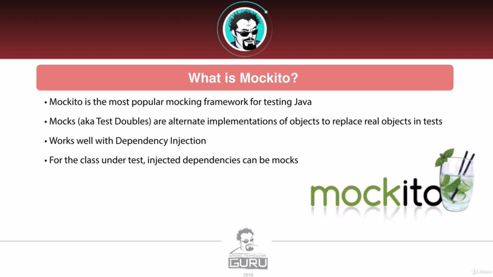
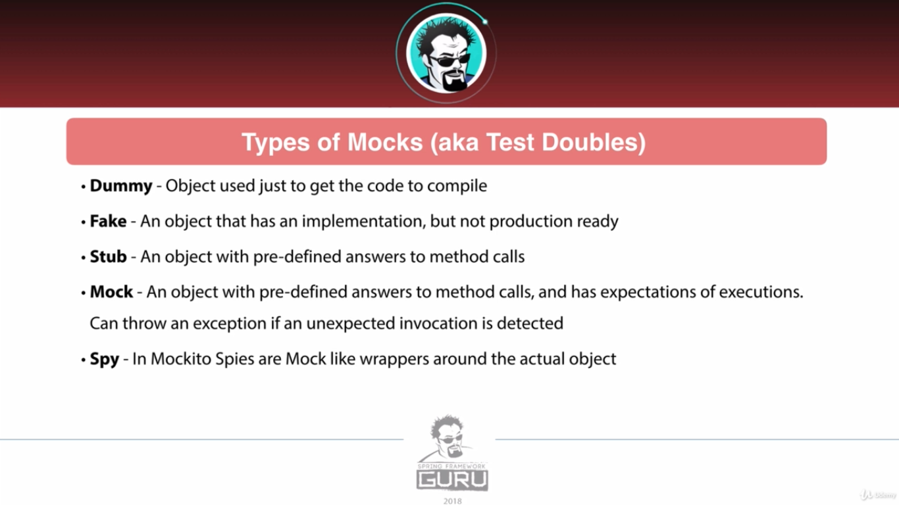
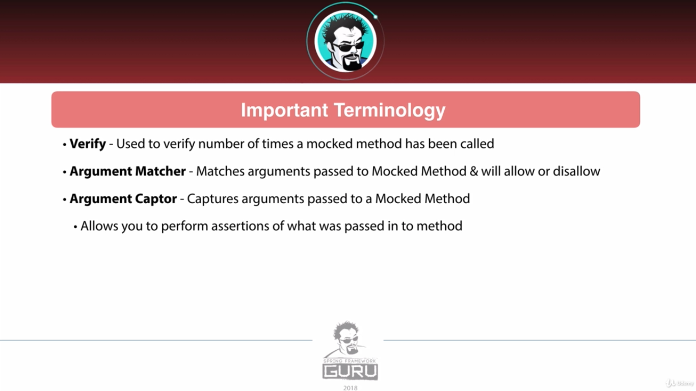
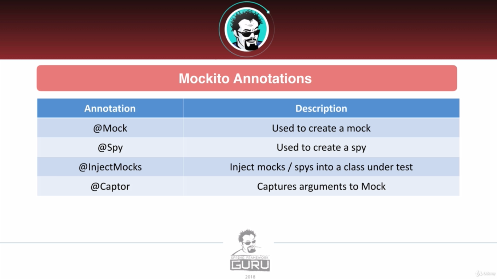
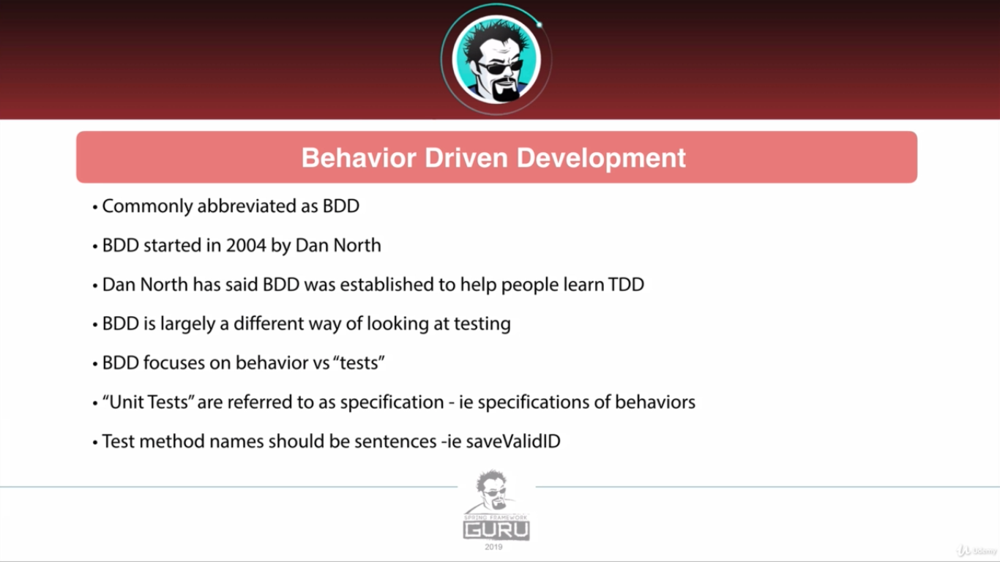
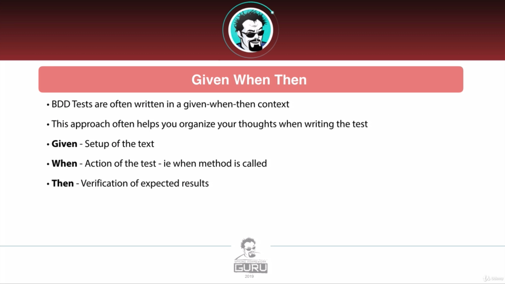
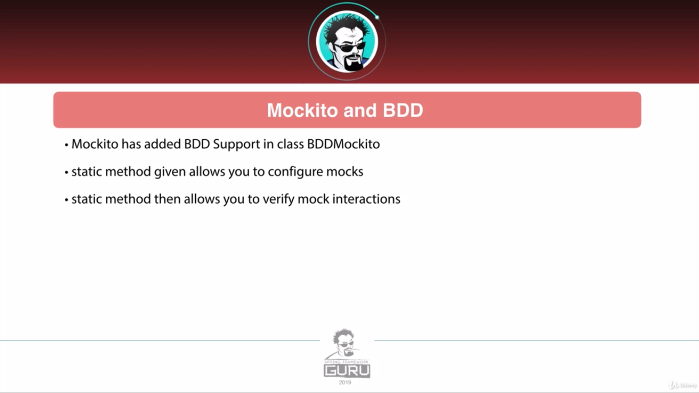

# Mockito

Mockito is a testing framework which aids us by creating mocks from dependency objects so, we don't bother creating
exact objects from collaborator objects.

## What is Mockito?






For installation, we need mockito-core & mockito-jupiter.

### Test Doubles

* Dummy: Objects not use in test, just fills the holes and keeps the compiler happy.
* Fake: lightweight example of object which is not suitable for production, like in memory db and fake web service
* Stub: provides canned answers, not intelligent enough to respond with anything, These can be hardcoded or configurable
* Spy: More intelligent stub, keeps track of how it was used, also helps with verification.
* Mocks: Use expectations, can fail the test if unexpected calls are made, The focus is on behavior verification. 

## Usage

### Create inline mocks

We can use static method `mock(dpendant.class)` to initialize Dependencies in our test class and then pass them to
the main class in setup method.

### Create mocks with annotation

First we write the signature of the CLass we want then, we annotate it with `@Mock`. We create a setup method and write:
`MockitoAnnotations.initMocks(this)`
Then we can correctly use the mock.

Instead of this setup method we can use `@ExtendWIth(MockitoExtension.class)` which is way cleaner.

### Inject Mocks using Mockito

Our class has some dependencies like repositories, We do as below:

* Create Mock of the dependency
* Create The current Class instance and annotate it with `@InjectMocks`.

This will inject all mocks into the current class instance.

### Verify mocks Execution

Mockito verify method accepts two arguments:

* mock object
* time

Then we chain the verify method with the function call. this will make sure how many times the method is invoked.

`verify(mockObject, times(2)).delete()`

instead of times we also can call methods:

* atLeastOnce()
* atMost()
* never()

### Returning values from Mocks

In order to do that we call when() and pass the mock object with the proper method call and chain then() and give the
type it should return.

`when(repository.findById(1L)).thenReturn(ReturnType)`
Then we call the function above, and we can assert test the return type.

### Argument Matcher

There are some methods like any(), anyLong(), etc. That we can use in our verify statement.

`verify(mockObject, times(2)).delete(any(InputType.class))`

## Behavior Driven Mockito





```java
// given
Model model=new Model();
        given(Repositoru.function()).willReturn(Optional.of(Model));

// when
        var foo=service.function();

// then
// assertion test
        then(repository).should().function();
        then(repository).shouldHaveNoMoreInteractions();
```

## Advanced Mockito

### Throw Exception

in order to assert that the object handles exception correctly we can use mockito `willThrow()` & `doThrow()` functions.
in regular or BDD way.

### Filter using lambda

In our given statement, we can use `argThat()` function and pass lambda which can filter the input argument of the
function we are trying to call.

### Argument Capture

In order to use argument capture we can create a field annotated with `@Captor` or create a local variable.
`final ArgumentCaptor<String> captor = ArgumentCaptor.forClass(String.class)`

### Mockito Answers

> NOt GOOD EXPLANATION, GOTTA LEARN Later!
