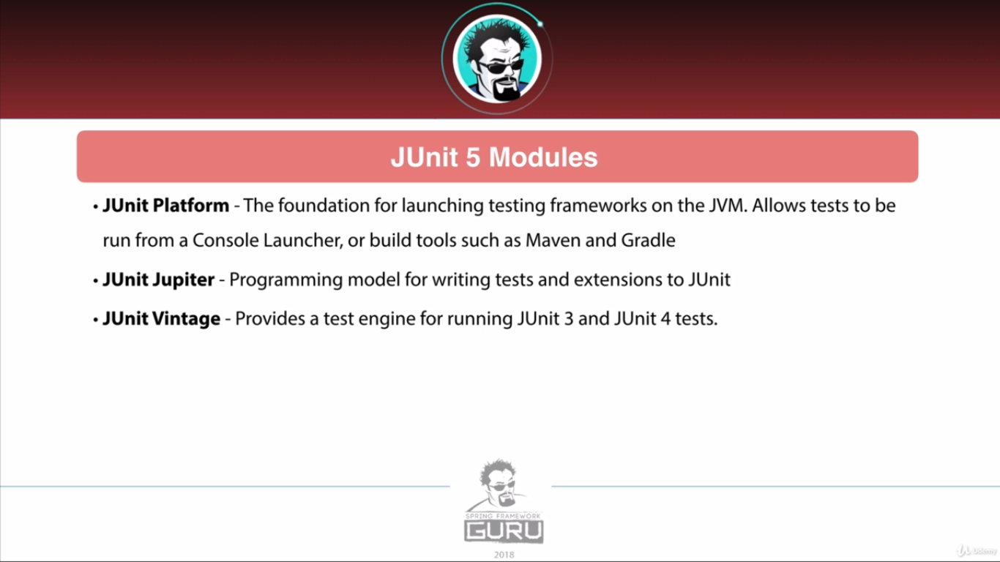
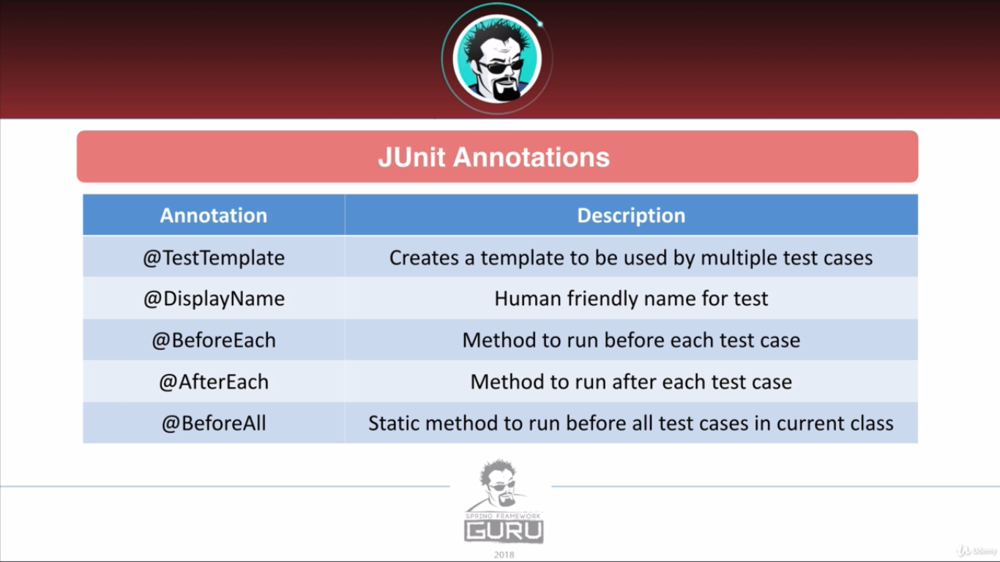
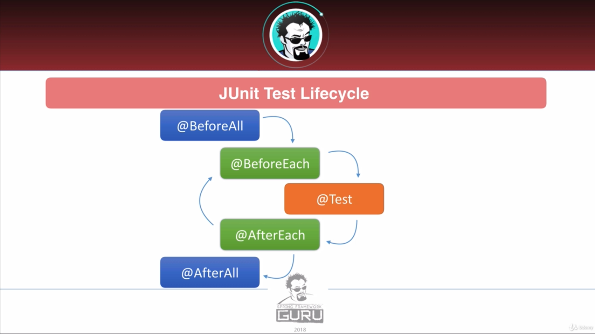
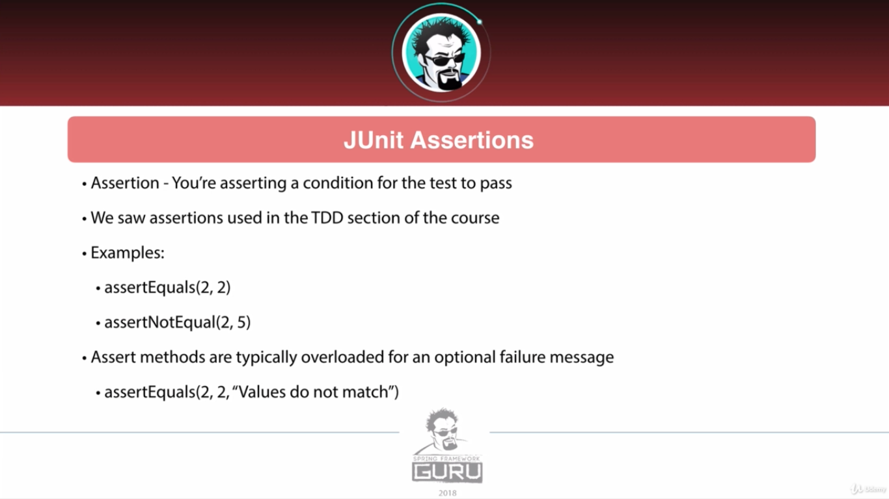
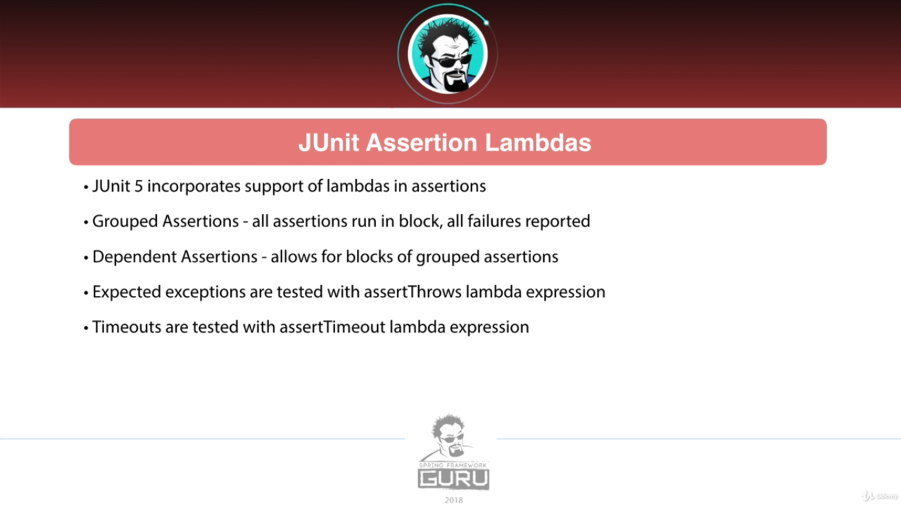
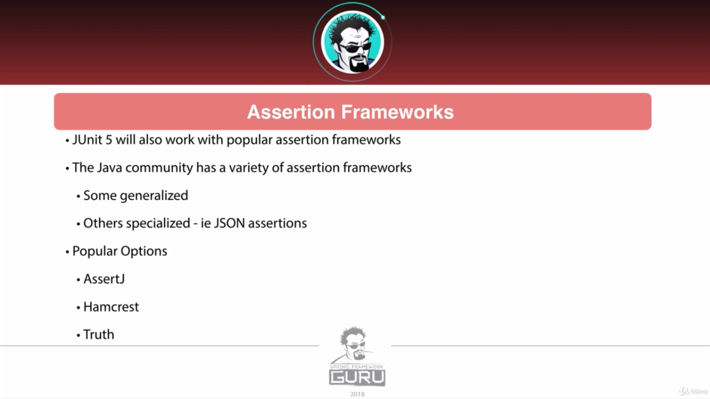
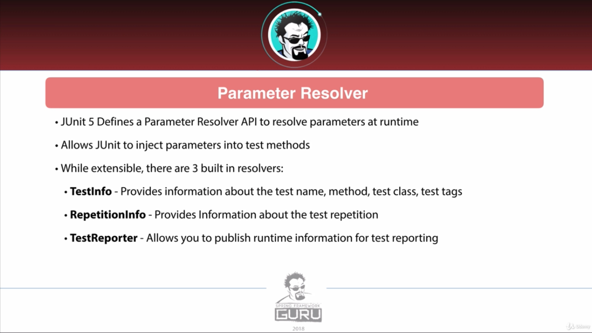
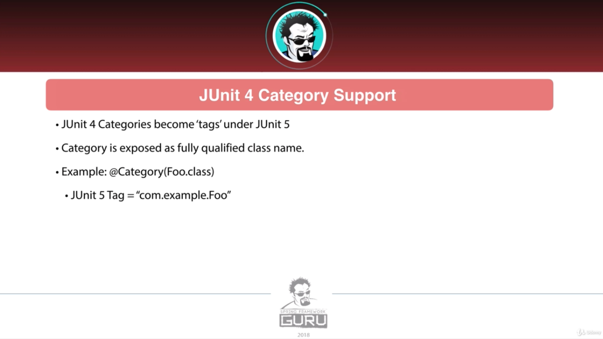
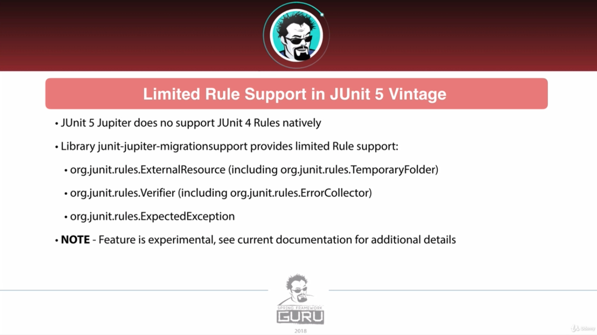

# Junit Framework

***

## Introduction







## Create Test classes

We can easily create Test classes With the naming convention of `${ClassName}Test` under test directory. Then we can simply Create test methods and annotate them with `@Test` Which comes from Junit Jupiter package.
In order to get rid of duplicating class initialization in each test method, we can simply create a setup method annotated with `@BeforeEach` and initialize the object in that.

## Junit Features

### Assertions





> We can also pass a lambda expression to assertion methods and return a message so if the assertion fails, it displays that message.

#### assertAll()

assertAll method accepts a heading string then, we can pass assertion methods as lambda to it.

```java
assertAll("Tests field validation",
                () -> assertEquals("Tim", person.getFirstName(), "How is it possible getter not work properly!"),
                () -> assertEquals("Hanks", person.getLastName(), "getName not working properly!")
        );
```

#### Dependant assertions

We can also chain `assertAll()` methods for dependant assertion tests.

```java
assertAll("Owner assertions:",
                () -> assertAll("Owner fields test",
                        () -> assertEquals("joe", owner.getFirstName()),
                        () -> assertEquals("Exotic", owner.getLastName())),
                () -> assertAll("Owner properties test",
                        () -> assertEquals("Los Santos", owner.getCity()),
                        () -> assertEquals("backup street", owner.getAddress()))
        );
```

#### Skipping tests

We can annotate test class or test methods with `@Disabled` to skip tests. We can also pass a message to it.

#### @Display-name

It's always best practice having descriptive names for components, We can achieve this by using this annotation on top of test method.

#### Testing expected Exceptions

In order to test if a method throws the correct exception we can use assertThrow() function and pass the ExceptionType and a lambda for invoking the desired functions.

```java
assertThrows(RuntimeException.class, () -> Class.function())
```

#### Testing Timeouts

We mostly work with two functions:

* assertTimeout(): Assert the execution of the supplier before given time exceeded.
* assertTimeoutPreemptively(): Assert the execution of the executable before given time exceeded.

> The difference is that assertTimeOut() executes in a different thread. It means assertTimeout() runs the executable, and after it is finished, if the time is exceeded it will fail but preemptively fails immediately if execution takes longer.

#### Conditional Test Execution

We can Classify tests with some annotation that apply a  rule on test method. for example if the OS is linux or an environment variable value is something, or base on script, All these are accessible in Junit documentation.

### Junit Assumptions

Assumptions check an optional condition for example if we are running a specific environment like CI server or checking a system environment.
`assertTrue()`

### Using AssertJ wih Junit

assertj is a rich library for assertions using declarative programming.

### Using Hamcrest wih Junit

Much older project but still relevant.

## Advanced Concepts of Junit

### Junit Tags

Tags are for classifying tests and can be applied at class level or method level. All we need to do is to annotate the classes, then in IDE run/debug configuration, we need to create a Junit config and determine tag value and execute it. Build tools have similar functionality which are getting into later.

### Junit Nested Test

To organize Big test classes even more convenient, we can create inner classes and mark them with @Nested. This is a much better way to classify Big test classes with lots of features.

### Junit Test interfaces

We can define interfaces and give them a tag and implement them with Junit test classes.

### Junit default test methods

For interfaces to have default methods we need to specify the lifeCycle of objects. We specify `@TestInstance(TestInstance.LifeCycle.PER_CLASS)`.
We have another option `PER_METHOD`.

### Repeating test using Junit

By declaring `@RepeatedTest` and passing a value to it Junit will repeat that test. We can also pass name and customize it. The customization is pretty detailed by getting to implementation.


We can pass these as parameters and get runtime information from them.

### Junit Parameterized Tests

For parameterized tests we need, another maven dependency `junit-jupiter-params` from the time of the tutorial I watched this was an experimental feature.

All we have to do is to annotate test method with `@ParameterizedTest` and `@ValueSource` and pass the parameters to it. junit will run the test method with these values.

This annotation name argument also works like repeated test annotation.
We can also use `@EnumSource` and pass enum for the test.
`@CSVSource` also allows passing csv parameters.
`@CSVFileSource` uses a csv file in resources directory, and we can also specify the number of lines to skip.

We can create static method with return type of `Stream<Arguments>` which is a Junit implemented class. we can use this to get some parameters from special sources like datasource, jms etc.
We annotate the method with `@MethodSource` and pass the static method name.

We can create a Class which returns these arguments and pass it to method with `@ArgumentsSource`. All we have to do is to create a class which implements `ArgumentsProvider` from jupiter and implement the provideArguments method.

We can also create Junit tests and extend them using `@ExtendWith()`

## Junit 4 vs Junit 5





